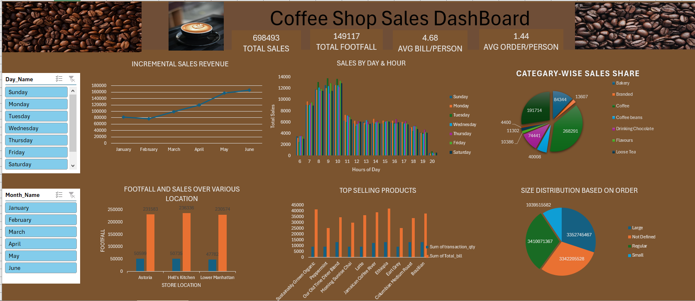
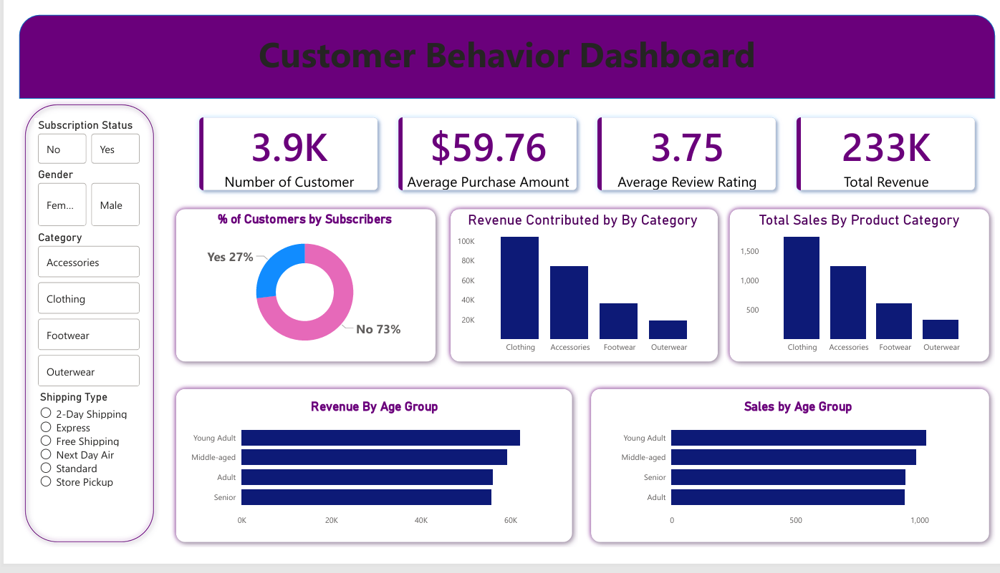

# Hi, I'm Dixit 👋

### 📊 Data Analyst | 🤖 Machine Learning Enthusiast | 📈 BI Developer

---

## 🧠 About Me

I am a Data Analyst focused on transforming raw data into actionable business insights using **SQL, Python, Excel, Power BI, and Machine Learning**.

I specialize in building **end-to-end analytics pipelines**, from data cleaning to dashboarding and insight delivery.

---

## 🚀 What I Do

- 📊 Data Cleaning & Preprocessing
- 🗄️ SQL-based Business Analysis
- 📈 Dashboard Development (Power BI / Excel)
- 🤖 Basic Machine Learning Models
- 📉 Data-driven Business Insights

---

## 📊 Dashboard Showcase

### 📌 Excel Dashboard (Sales & KPI Analysis)

**Highlights:**
- KPI tracking (Revenue, Profit, Sales trends)
- Business performance insights
- Excel-based visualization and reporting

---

### 📌 Power BI Retail Dashboard

**Highlights:**
- Retail sales performance analysis
- Interactive filters and insights
- Region-wise and category-wise breakdown
- Business decision support dashboard

---

## 🛠️ Tech Stack

### Languages & Tools

- Python
- SQL / MySQL
- Excel
- Power BI
- Pandas
- NumPy
- Matplotlib
- Seaborn
- Scikit-learn
- SQLAlchemy
- Jupyter Notebook

---

## 📌 Featured Projects

### 🛒 Retail Analytics Project
Built an end-to-end analytics system to analyze sales performance, identify revenue trends, and support business decision-making using Python, SQL, and Power BI.

### 📊 Customer Churn Analysis
Identified churn patterns and high-risk customer segments using exploratory data analysis and visualization.

### 🍕 Pizza Sales SQL Analysis
Solved business problems using SQL queries to analyze revenue, product performance, and customer behavior.

---

## 🌱 Currently Learning

- Advanced SQL Optimization
- Feature Engineering
- Machine Learning Models
- RAG-based Analytics Systems

---

## 📫 Connect With Me

- LinkedIn: https://www.linkedin.com/in/dixit-data-analyst/

---

⭐ Turning data into actionable business insights through analytics and dashboards.
